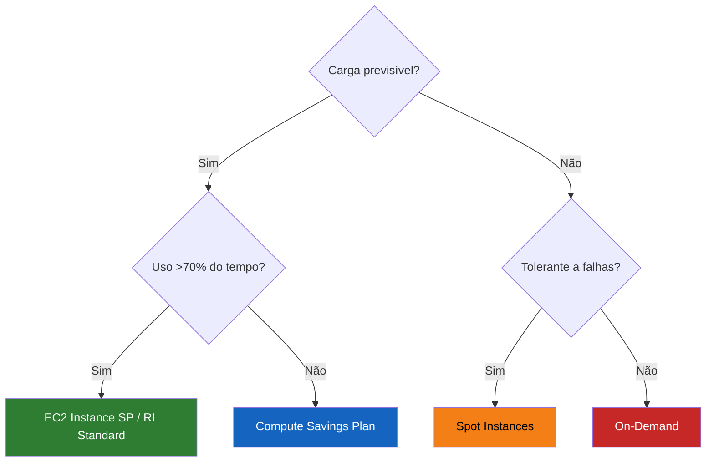
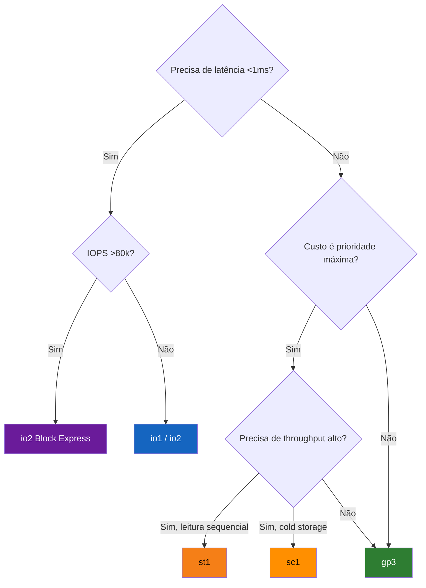
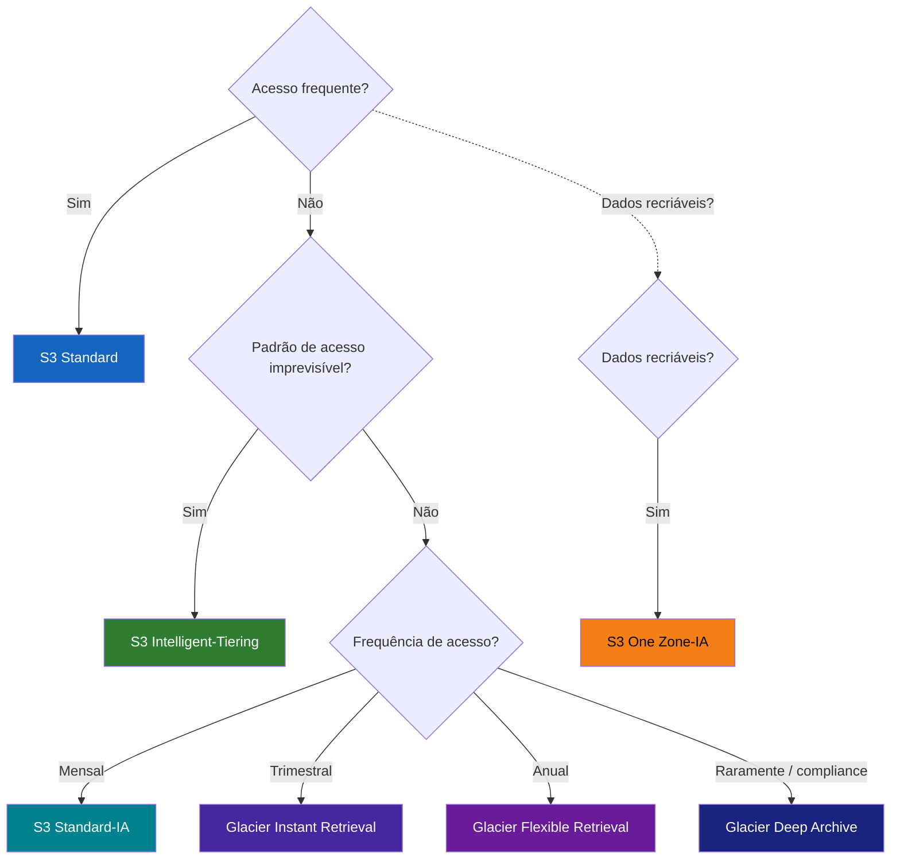
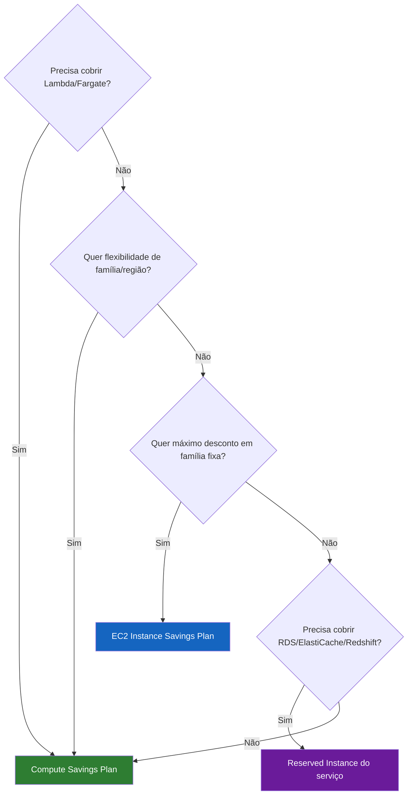
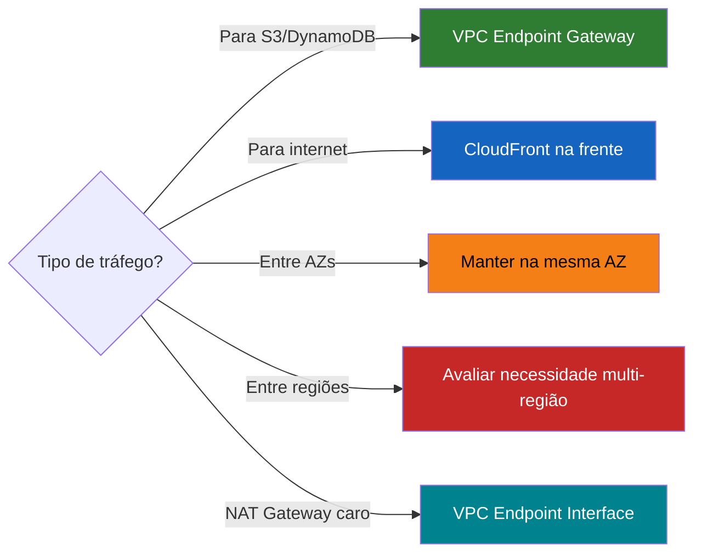
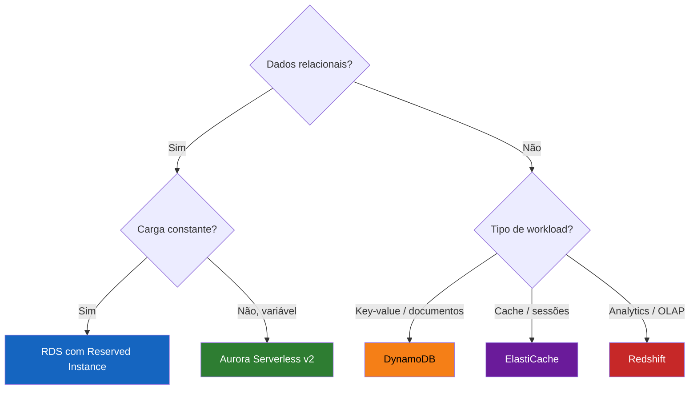

# Diagramas de Decisão para Otimização de Custos na AWS

Guia visual para tomar decisões rápidas de otimização de custos na AWS. Use estes fluxogramas como referência ao arquitetar ou revisar workloads.

---

## 1. Qual modelo de compra EC2 usar?

> **Recomendação:** Comece com Compute Savings Plan para ter flexibilidade. Use Spot para workloads batch/tolerantes e reserve Instance SP apenas quando tiver certeza da família e região.

---

## 2. Qual tipo de volume EBS escolher?

> **Recomendação:** Use **gp3 SEMPRE** como padrão. Nunca crie gp2 — gp3 é mais barato e mais performático. Migre volumes gp2 existentes imediatamente.

---

## 3. Qual classe de armazenamento S3 usar?

> **Recomendação:** Na dúvida, use **Intelligent-Tiering** — ele move automaticamente entre tiers sem custo de retrieval. Para dados que você sabe que são frios, vá direto para Glacier.

---

## 4. Savings Plan vs Reserved Instance?

> **Recomendação:** Compute Savings Plan é o mais versátil (cobre EC2, Fargate e Lambda). Use EC2 Instance SP só quando tiver compromisso firme com família/região. RIs são obrigatórias para RDS e outros serviços que não suportam SP.

---

## 5. Como reduzir custos de transferência de dados?

> **Recomendação:** VPC Gateway Endpoints para S3/DynamoDB são **gratuitos** — não há motivo para não usar. CloudFront elimina custo de transferência EC2→Internet (EC2→CloudFront é grátis).

---

## 6. Qual banco de dados usar?

> **Recomendação:** Aurora Serverless v2 é ideal para cargas variáveis — escala a zero e evita pagar por capacidade ociosa. Para DynamoDB, use modo on-demand se o padrão for imprevisível, e provisionado com auto-scaling se for estável.

---

## Resumo Rápido

| Decisão | Escolha Padrão (safe default) |
|---------|-------------------------------|
| Modelo EC2 | Compute Savings Plan |
| Volume EBS | gp3 |
| Classe S3 | Intelligent-Tiering |
| Compromisso | Compute SP (1 ano, sem pagamento adiantado) |
| Transferência | VPC Endpoints + CloudFront |
| Banco de dados | Aurora Serverless v2 / DynamoDB on-demand |

---

*Referência do curso [FinOps na AWS](https://turing.education/finops)*
