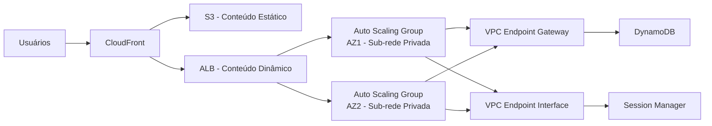

# Lab 04 – Reduzir Custos de Rede com CloudFront e VPC Endpoints

## Objetivo

Reduzir custos de transferência de dados usando Amazon CloudFront para cache de conteúdo e VPC Endpoints para eliminar tráfego pelo NAT Gateway.



## Serviços Utilizados

- Amazon CloudFront
- VPC Endpoints (Gateway e Interface)
- EC2 Auto Scaling
- Amazon DynamoDB
- Amazon S3
- Elastic Load Balancing (ALB)

## Arquitetura

A arquitetura utiliza uma região AWS com 2 Availability Zones. Dentro da VPC temos sub-redes públicas (com ALB) e privadas (com instâncias EC2 em Auto Scaling). O CloudFront fica na frente de tudo, roteando requisições estáticas para um bucket S3 e requisições dinâmicas para o ALB. Um VPC Endpoint Gateway conecta as sub-redes privadas diretamente ao DynamoDB, eliminando a necessidade de NAT Gateway para esse tráfego. Um VPC Endpoint Interface permite acesso ao Session Manager sem internet.

```
Usuário → CloudFront → /static/* → S3 (origem estática)
                      → /*       → ALB → Auto Scaling (t3.micro, 2 AZs)
                                              ↓
                                   VPC Endpoint Gateway → DynamoDB
                                   VPC Endpoint Interface → Session Manager
```

## Passo a Passo

### 1. Criar distribuição CloudFront com duas origens

- **Origem 1 (S3):** crie um bucket S3 para conteúdo estático. No CloudFront, adicione como origem com Origin Access Control (OAC).
- **Origem 2 (ALB):** adicione o ALB como segunda origem com protocolo HTTPS.

```bash
# Criar bucket para conteúdo estático
aws s3 mb s3://finops-lab04-static-<ACCOUNT_ID>

# Upload de exemplo
aws s3 cp ./assets/ s3://finops-lab04-static-<ACCOUNT_ID>/static/ --recursive
```

### 2. Configurar comportamentos de cache

No console do CloudFront ou via CLI:

| Path Pattern | Origem | Cache Policy |
|---|---|---|
| `/static/*` | S3 | CachingOptimized |
| `/*` (default) | ALB | CachingDisabled |

### 3. Definir TTL para conteúdo estático

Configure o header `Cache-Control` nos objetos S3:

```bash
aws s3 cp ./assets/ s3://finops-lab04-static-<ACCOUNT_ID>/static/ \
  --recursive \
  --cache-control "max-age=86400, public"
```

Isso garante que o CloudFront mantenha o cache por 24 horas, reduzindo requisições à origem.

### 4. Criar grupo de Auto Scaling com instâncias menores

Substitua instâncias `t3.large` por `t3.micro` — o CloudFront absorve a carga de conteúdo estático.

```bash
# Criar Launch Template
aws ec2 create-launch-template \
  --launch-template-name finops-lab04-lt \
  --launch-template-data '{
    "InstanceType": "t3.micro",
    "ImageId": "ami-xxxxxxxxxxxxxxxxx",
    "SecurityGroupIds": ["sg-xxxxxxxx"]
  }'

# Criar Auto Scaling Group
aws autoscaling create-auto-scaling-group \
  --auto-scaling-group-name finops-lab04-asg \
  --launch-template LaunchTemplateName=finops-lab04-lt,Version='$Latest' \
  --min-size 2 --max-size 4 --desired-capacity 2 \
  --vpc-zone-identifier "subnet-private-1,subnet-private-2" \
  --target-group-arns "arn:aws:elasticloadbalancing:..."
```

### 5. Criar VPC Endpoint Gateway para DynamoDB

```bash
aws ec2 create-vpc-endpoint \
  --vpc-id vpc-xxxxxxxx \
  --service-name com.amazonaws.<REGION>.dynamodb \
  --route-table-ids rtb-private-1 rtb-private-2 \
  --vpc-endpoint-type Gateway
```

### 6. Criar VPC Endpoint Interface para Session Manager

```bash
aws ec2 create-vpc-endpoint \
  --vpc-id vpc-xxxxxxxx \
  --service-name com.amazonaws.<REGION>.ssm \
  --subnet-ids subnet-private-1 subnet-private-2 \
  --security-group-ids sg-xxxxxxxx \
  --vpc-endpoint-type Interface \
  --private-dns-enabled
```

Repita para `ssmmessages` e `ec2messages` se necessário.

### 7. Testar acesso ao DynamoDB sem NAT Gateway

Conecte na instância via Session Manager e execute:

```bash
aws dynamodb list-tables --region <REGION>
```

Se funcionar sem NAT Gateway ativo, o endpoint está operando corretamente.

### 8. Comparar custos antes e depois

| Item | Antes | Depois |
|------|-------|--------|
| NAT Gateway (processamento) | ~$0.045/GB | $0.00 (via endpoint) |
| NAT Gateway (hora) | ~$0.045/h = ~$32/mês | $0.00 |
| Transferência de dados (origem) | $0.09/GB | ~$0.01/GB (CloudFront) |
| Instâncias | t3.large × 2 = ~$120/mês | t3.micro × 2 = ~$15/mês |
| VPC Endpoint Gateway | — | $0.00 (gratuito) |
| VPC Endpoint Interface | — | ~$0.01/h por AZ |

## Dicas de Economia

- **VPC Endpoint Gateway é gratuito** — use sempre para S3 e DynamoDB.
- **CloudFront reduz transferência da origem** — quanto maior o cache hit ratio, menor o custo.
- **Invalide com critério** — invalidações em massa custam dinheiro. Use versionamento de arquivos (`/static/v2/app.js`) em vez de invalidar.
- **Monitore o Cache Hit Ratio** no CloudWatch. Abaixo de 80%? Revise seus TTLs.
- **Elimine o NAT Gateway** se o único tráfego externo for para serviços AWS — use endpoints.
- **Instâncias menores + Auto Scaling** funcionam melhor que instâncias grandes ociosas.
