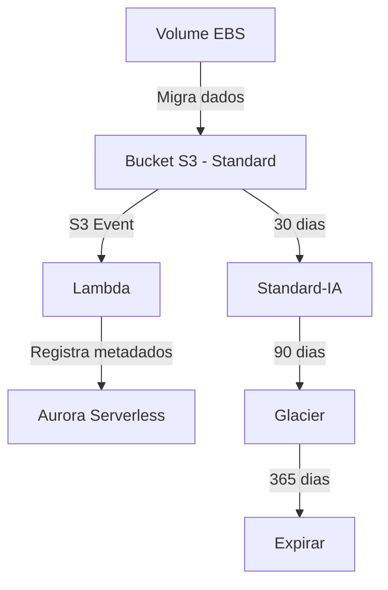

# Lab 05 – Reduzir Custos de Armazenamento com Ciclo de Vida do S3

## Objetivo

Reduzir custos de armazenamento migrando dados de volumes EBS para Amazon S3 com regras de ciclo de vida automáticas, e usando Lambda + Aurora Serverless como catálogo de metadados.



## Serviços Utilizados

- Amazon S3
- AWS Lambda
- Amazon Aurora Serverless

## Arquitetura

Um bucket S3 com versionamento armazena os dados migrados do EBS. Regras de lifecycle movem objetos automaticamente entre classes de armazenamento. Quando um objeto é criado no bucket, um evento S3 aciona uma função Lambda que registra os metadados (nome, tamanho, data, classe) em uma tabela no Aurora Serverless. O Aurora serve como catálogo consultável via Data API.

```
Upload/Sync → S3 Bucket (Standard)
                  ↓ 30 dias
              Standard-IA
                  ↓ 90 dias
              Glacier Flexible Retrieval
                  ↓ 365 dias
              Expiração (delete)

Evento PutObject → Lambda → Aurora Serverless (catálogo de metadados)
```

## Passo a Passo

### 1. Criar bucket S3 com versionamento habilitado

```bash
BUCKET_NAME="finops-lab05-lifecycle-<ACCOUNT_ID>"

aws s3api create-bucket \
  --bucket $BUCKET_NAME \
  --region <REGION> \
  --create-bucket-configuration LocationConstraint=<REGION>

aws s3api put-bucket-versioning \
  --bucket $BUCKET_NAME \
  --versioning-configuration Status=Enabled
```

### 2. Configurar regra de ciclo de vida

```bash
aws s3api put-bucket-lifecycle-configuration \
  --bucket $BUCKET_NAME \
  --lifecycle-configuration '{
    "Rules": [
      {
        "ID": "finops-lifecycle-rule",
        "Status": "Enabled",
        "Filter": {"Prefix": ""},
        "Transitions": [
          {"Days": 30, "StorageClass": "STANDARD_IA"},
          {"Days": 90, "StorageClass": "GLACIER"}
        ],
        "Expiration": {"Days": 365},
        "NoncurrentVersionExpiration": {"NoncurrentDays": 30}
      }
    ]
  }'
```

### 3. Criar cluster Aurora Serverless com tabela de índice

```bash
# Criar cluster Aurora Serverless v2
aws rds create-db-cluster \
  --db-cluster-identifier finops-lab05-catalog \
  --engine aurora-mysql \
  --engine-version 8.0.mysql_aurora.3.04.0 \
  --serverless-v2-scaling-configuration MinCapacity=0.5,MaxCapacity=2 \
  --master-username admin \
  --master-user-password <SENHA_SEGURA> \
  --enable-http-endpoint

# Criar tabela via Data API
aws rds-data execute-statement \
  --resource-arn "arn:aws:rds:<REGION>:<ACCOUNT_ID>:cluster:finops-lab05-catalog" \
  --secret-arn "arn:aws:secretsmanager:<REGION>:<ACCOUNT_ID>:secret:..." \
  --database "catalog" \
  --sql "CREATE TABLE objects_index (
    id INT AUTO_INCREMENT PRIMARY KEY,
    object_key VARCHAR(1024),
    size_bytes BIGINT,
    storage_class VARCHAR(50),
    created_at TIMESTAMP DEFAULT CURRENT_TIMESTAMP
  )"
```

### 4. Criar função Lambda para indexar objetos

A Lambda é acionada pelo evento `s3:ObjectCreated:*` e registra metadados no Aurora:

```python
import boto3
import os

rds_data = boto3.client('rds-data')

CLUSTER_ARN = os.environ['CLUSTER_ARN']
SECRET_ARN = os.environ['SECRET_ARN']
DATABASE = os.environ['DATABASE']

def handler(event, context):
    for record in event['Records']:
        key = record['s3']['object']['key']
        size = record['s3']['object']['size']

        rds_data.execute_statement(
            resourceArn=CLUSTER_ARN,
            secretArn=SECRET_ARN,
            database=DATABASE,
            sql="INSERT INTO objects_index (object_key, size_bytes, storage_class) VALUES (:key, :size, 'STANDARD')",
            parameters=[
                {'name': 'key', 'value': {'stringValue': key}},
                {'name': 'size', 'value': {'longValue': size}}
            ]
        )
```

Configure o trigger S3 → Lambda:

```bash
aws s3api put-bucket-notification-configuration \
  --bucket $BUCKET_NAME \
  --notification-configuration '{
    "LambdaFunctionConfigurations": [
      {
        "LambdaFunctionArn": "arn:aws:lambda:<REGION>:<ACCOUNT_ID>:function:finops-lab05-indexer",
        "Events": ["s3:ObjectCreated:*"]
      }
    ]
  }'
```

### 5. Migrar dados do volume EBS para o bucket S3

```bash
# Na instância EC2 com o volume montado
aws s3 sync /mnt/ebs-data/ s3://$BUCKET_NAME/migrated-data/
```

### 6. Verificar que os dados estão acessíveis

```bash
# Listar objetos migrados
aws s3 ls s3://$BUCKET_NAME/migrated-data/ --recursive --human-readable

# Consultar catálogo no Aurora
aws rds-data execute-statement \
  --resource-arn $CLUSTER_ARN \
  --secret-arn $SECRET_ARN \
  --database catalog \
  --sql "SELECT COUNT(*), SUM(size_bytes) FROM objects_index"
```

### 7. Criar snapshot do volume EBS e deletar o volume

```bash
# Criar snapshot antes de deletar
aws ec2 create-snapshot \
  --volume-id vol-xxxxxxxx \
  --description "Backup antes de migração para S3 - Lab05"

# Após confirmar que o snapshot está completo
aws ec2 delete-volume --volume-id vol-xxxxxxxx
```

### 8. Verificar transições de classe

Após 30+ dias, verifique a classe de armazenamento:

```bash
aws s3api head-object \
  --bucket $BUCKET_NAME \
  --key migrated-data/exemplo.txt
# Verifique o campo "StorageClass"
```

Use o S3 Storage Lens para visualizar a distribuição por classe ao longo do tempo.

## Dicas de Economia

- **Standard-IA cobra por acesso** — só mova dados que realmente são acessados com pouca frequência.
- **Glacier tem custo de retrieval** — planeje restaurações com antecedência (Bulk = mais barato).
- **Versionamento gera cópias** — configure `NoncurrentVersionExpiration` para não acumular versões antigas.
- **Delete markers também ocupam espaço** — inclua regra para expirar delete markers órfãos.
- **Aurora Serverless v2 escala a zero** — ideal para catálogos consultados esporadicamente.
- **EBS é ~5x mais caro que S3 Standard** — migre dados frios sem pensar duas vezes.
- **Use S3 Intelligent-Tiering** se não souber o padrão de acesso — a AWS move automaticamente.
